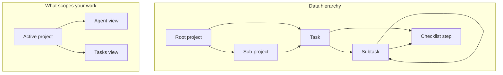

# QTask — User Guide

How to use QTask day to day: projects, tasks, subtasks, agent, search, and sharing.

Official site: **https://qtask.dev** · Source: [github.com/dbeasty/qtask](https://github.com/dbeasty/qtask)

---

## Table of Contents

1. [How QTask is organized](#1-how-qtask-is-organized)
2. [Getting started](#2-getting-started)
3. [Your first 10 minutes](#3-your-first-10-minutes)
4. [Projects](#4-projects)
5. [Active project](#5-active-project)
6. [Tasks and subtasks](#6-tasks-and-subtasks)
7. [Checklist steps (not subtasks)](#7-checklist-steps-not-subtasks)
8. [Agent](#8-agent)
9. [Search](#9-search)
10. [Preferences](#10-preferences)
11. [Expense tracking](#11-expense-tracking)
12. [Sharing and roles](#12-sharing-and-roles)
13. [Keyboard shortcuts](#13-keyboard-shortcuts)
14. [FAQ and troubleshooting](#14-faq-and-troubleshooting)
15. [More help](#15-more-help)

---

## 1. How QTask is organized

QTask has three main views in the header: **Projects**, **Tasks**, and **Agent**. Most work is scoped to your **active project** (see [Active project](#5-active-project)).

| Concept | What it is |
|---------|------------|
| **Project** | A workspace that groups related work. Projects can nest under other projects (parent/child tree). |
| **Task** | A work item. Tasks live in one or more projects and can have nested **subtasks**. |
| **Subtask** | A breakdown item inside a task (or inside another subtask). Subtasks do not belong to projects directly — they inherit context from their parent task. |
| **Step** | A checkbox checklist line on a task or subtask. Steps are **not** the same as subtasks — use steps for simple to-do lines; use subtasks when you need status, progress, or further nesting. |

---

## 2. Getting started

1. Create an account and verify your email (check your inbox for the verification link).
2. Sign in. You will see the app header with search, your account menu, and three main views: **Agent**, **Projects**, and **Tasks**.
3. Open your account menu (your name or email in the header) for preferences, password, legal pages, **Help**, and **Take a tour**.
4. Use **Projects** to organize workspaces, **Tasks** to manage work items, and **Agent** to ask the AI assistant to create or update work (with your approval).

If you are new, follow [Your first 10 minutes](#3-your-first-10-minutes) or use **Take a tour** from the account menu for a guided walkthrough.

---

## 3. Your first 10 minutes

A quick path from empty account to your first agent-assisted tasks:

1. **Register and sign in** — accept the terms, verify your email, then log in.
2. **Create a project** — open **Projects**, click **+ Add project**, enter a name (for example `Home renovation`), and save. The project appears in the tree on the left.
3. **Set the active project** — click the project in the tree. The **Current project** label shows what is selected. Agent and Tasks use this project.
4. **Add a task** — open **Tasks**, click **+ Add task**, enter a title, and fill in details in the panel on the right. Changes save automatically.
5. **Add a subtask** — select the task in the tree, click **+ Add subtask**, and enter a subtask title.
6. **Try the Agent** — open **Agent**, click **New session** if needed, and send a message such as: *Create three tasks: Plan the work, Build the feature, Review and ship.*
7. **Approve a proposal** — when the agent proposes changes, review the **Pending approval** bar at the bottom and click **Approve** (or **Reject**). Nothing is applied until you approve, unless you have auto-approve enabled in preferences.
8. **Search** — press **⌘K** (Mac) or **Ctrl+K** (Windows/Linux) to focus search, or type in the header search box to find tasks and projects.

---

## 4. Projects

Projects group related tasks. They can form a **tree**: a project may sit under a parent project.

### Create a project

1. Open the **Projects** view.
2. Click **+ Add project** to create a **root** project, or select a project and click **+ Add sub project** to create a **child** under it.
3. Enter a name and optional description in the detail panel on the right. Changes save automatically.

### Select and edit

- Click a project in the tree to select it and set it as the **active project**.
- Edit name, description, and (for nested projects) **progress share** in the detail panel.

### Nest and move

- Create a child under any project you can edit.
- Drag a project in the tree to reorder or reparent it, or use **Move** from the project menu.
- You cannot move a project under one of its own descendants (that would create a cycle).

### Progress

- **Leaf** projects (no child projects): percent complete is the average of linked tasks; status follows those tasks.
- **Parent** projects: percent complete rolls up from child projects. Set each child’s **progress share** (relative weight) so some sub-projects count more toward the parent.
- Status on parents is derived from children (for example, all done → done; any activity → in progress).

### Members

- Select a project and click **Members** in the detail panel to invite or manage collaborators.
- Roles and permissions are **per project**. Nesting does not automatically share access with parent or child projects.

### Delete

- Deleting a project **reparents** its direct children to the deleted project’s former parent (or to root if it was a top-level project).
- Tasks that belonged **only** to the deleted project are removed.
- Tasks also linked to other projects stay; they are only unlinked from the deleted project.

### Open tasks from a project

- With a project selected, click **Open tasks** in the detail panel to jump to the Tasks view for that project.

---

## 5. Active project

The **Current project** label on the Projects view (and the project bar on Tasks/Agent) shows your **active project**.

- **Agent** and **Tasks** are scoped to the active project.
- Switching projects changes which work you see and where new agent-driven work tends to land.
- On the Tasks view, click **Project · …** in the toolbar to open the Projects view and switch projects.
- Your active project choice is remembered between sessions.

---

## 6. Tasks and subtasks

Open the **Tasks** view to work with tasks in the active project.

### Create tasks

1. Click **+ Add task** in the task list panel.
2. Enter a title and optional details in the detail panel (description, status, priority, due date, tags, percent complete).
3. Changes save automatically when you edit fields.

### Create subtasks

1. Select a task (or subtask) in the tree.
2. Click **+ Add subtask**.
3. Edit the subtask in the detail panel the same way as a task.

Subtasks can nest further — a subtask can have its own subtasks. Parent progress often rolls up from children.

### Reorganize

- **Drag** tasks or subtasks in the tree to reorder them.
- Use the **Move** menu on an item to:
  - Move up or down among siblings
  - Reparent a subtask under another task
  - **Promote** a subtask to a top-level task
  - Attach another task as a subtask
- Delete via the Move menu or delete controls; you may choose to keep child subtasks when deleting.

### Work across projects

A task can belong to **one or more projects**. From the task detail panel, open the **Projects** dialog to:

| Action | What it does |
|--------|----------------|
| **Move to** | Move the task’s primary project link |
| **Also appear in** | Link the same task into another project (share) |
| **Duplicate** | Copy the task into another project |

Use **unlink** to remove a project link without deleting the task.

### Status and progress

- Set **status** (To do, In progress, Done, Cancelled) and **priority** on tasks and subtasks.
- **Leaf** items can set percent complete directly; parents often roll up from subtasks.

---

## 7. Checklist steps (not subtasks)

In the task detail panel, the **Steps** section is a simple checklist on the current task or subtask.

| Use **steps** when… | Use **subtasks** when… |
|---------------------|------------------------|
| You want quick checkbox lines | You need status, priority, or progress |
| The item does not need its own detail panel | You want to nest further or drag/reorder in the tree |
| Examples: “Buy screws”, “Call supplier” | Examples: “Install cabinets”, “Wire lighting” |

Steps appear in search results alongside task titles and project names.

---

## 8. Agent

Agent is the AI assistant for QTask.

### Sessions

- Each conversation is a **session** in the sidebar.
- Click **New session** to start a fresh thread.
- Use **Sessions** to expand the list and switch between past conversations.

### How proposals work

- **Write** actions (create/update tasks, share tasks, create top-level projects, etc.) appear as **proposals**.
- Review the **Pending approval** bar and click **Approve** or **Reject** before changes are applied.
- **Read** actions (search, get task, list projects, summarize) run without approval.
- If **Auto-approve agent actions** is enabled in your account menu, write actions apply automatically (you can still reject).

### Project nesting

Nesting projects (parent/child) is managed in the **Projects** UI. The agent can create **top-level** projects and work with tasks; use Projects to build and rearrange the hierarchy.

### Example prompts

| Goal | Example prompt |
|------|----------------|
| Create tasks | *Add tasks for ordering materials, scheduling the crew, and final inspection.* |
| Update work | *Mark “Install cabinets” as done and set “Wire lighting” to in progress.* |
| Find work | *What tasks are still in progress in this project?* |
| Summarize | *Summarize what is left to do before we can close out this project.* |

---

## 9. Search

Use the header search box to find projects and tasks by meaning, not just exact text.

- Type to search — results open in the Search view.
- Press **⌘K** (Mac) or **Ctrl+K** (Windows/Linux) to focus the search field quickly.
- Search matches task titles, project names, descriptions, tags, and checklist step text.
- Click a result to open the project or task.

---

## 10. Preferences

Open your account menu (header, top right) to adjust:

| Preference | Effect |
|------------|--------|
| **Auto-approve agent actions** | Agent write proposals apply immediately without clicking Approve |
| **Skip delete confirmations** | Deletes skip the confirmation dialog (use with care) |
| **Track expenses** | Shows hours and expense fields in task forms and project tracking |

You can also edit your display name and change your password from the account menu.

---

## 11. Expense tracking

When **Track expenses** is enabled in preferences:

- Task and subtask forms show **materials**, **labor**, and **hours spent** fields.
- Set your **hourly rate** in the account menu or per project/task where supported.
- On the Projects view, expand **Tracking** on a project to see a cost rollup across linked tasks.

Expense data is optional — turn off **Track expenses** if you only need task management without cost fields.

---

## 12. Sharing and roles

Each project has an owner and optional collaborators:

| Role | Typical access |
|------|----------------|
| **Owner** | Full control, including members |
| **Editor** | Edit project and tasks |
| **Executor** | Update status / progress-style fields |
| **Viewer** | Read-only |

Invite people by email when your deployment supports it. Access is always checked on the project you are working in.

---

## 13. Keyboard shortcuts

| Shortcut | Action |
|----------|--------|
| **⌘K** / **Ctrl+K** | Focus header search |

---

## 14. FAQ and troubleshooting

**I did not receive a verification email**
- Check spam/junk folders. Use the resend option on the verify-email page if available. Your administrator may need to configure email (see deployment docs).

**Agent says to select a project**
- Choose or create a project on the Projects view first. Agent and Tasks require an active project.

**I cannot edit a project or task**
- Your role may be **viewer** or **executor** (executors can update status but not all fields). Ask the project owner to adjust your role via **Members**.

**What is the difference between subtasks and steps?**
- **Subtasks** are nested work items in the task tree with their own status and detail panel. **Steps** are checklist lines on a single task/subtask. See [Checklist steps](#7-checklist-steps-not-subtasks).

**Can the agent create nested projects?**
- Not directly — use the Projects view to add sub-projects and move them in the tree. The agent can create top-level projects and manage tasks.

**How do I restart the guided tour?**
- Account menu → **Take a tour** (or **Help** → **Take a guided tour**).

---

## 15. More help

- **In the app:** account menu → **Help** or **Take a tour**
- **Full guide (this document):** [docs/USER_GUIDE.md](https://github.com/dbeasty/qtask/blob/main/docs/USER_GUIDE.md) on GitHub
- **Developers / self-hosting:** [README](../README.md), [DEPLOY.md](DEPLOY.md)
- **Product requirements:** [QTask_Product_Requirements.md](QTask_Product_Requirements.md)
- **Contribute:** [github.com/dbeasty/qtask](https://github.com/dbeasty/qtask)
