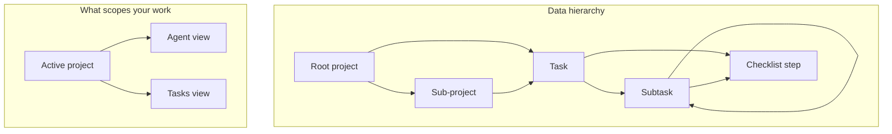

# QTask — User Guide

How to use QTask day to day: projects, tasks, subtasks, agent, search, and sharing.

Official site: **https://qtask.dev** · Source: [github.com/dbeasty/qtask](https://github.com/dbeasty/qtask)

---

## Table of Contents

1. [How QTask is organized](#1-how-qtask-is-organized)
   - [Connect external AI (MCP)](#connect-external-ai-mcp)
2. [Getting started](#2-getting-started)
3. [Your first 10 minutes](#3-your-first-10-minutes)
4. [Projects](#4-projects)
5. [Active project](#5-active-project)
6. [Tasks and subtasks](#6-tasks-and-subtasks)
7. [Checklist steps (not subtasks)](#7-checklist-steps-not-subtasks)
8. [Agent](#8-agent)
9. [Search](#9-search)
10. [Preferences](#10-preferences)
11. [Expense tracking](#11-expense-tracking)
12. [Sharing and roles](#12-sharing-and-roles)
13. [Keyboard shortcuts](#13-keyboard-shortcuts)
14. [FAQ and troubleshooting](#14-faq-and-troubleshooting)
15. [More help](#15-more-help)

---

## 1. How QTask is organized

QTask has three main views in the header: **Projects**, **Tasks**, and **Agent**. Most work is scoped to your **active project** (see [Active project](#5-active-project)).

```mermaid
flowchart TB
  subgraph hierarchy [Data hierarchy]
    ProjectRoot[Root project]
    SubProject[Sub-project]
    Task[Task]
    Subtask[Subtask]
    Step[Checklist step]
    ProjectRoot --> SubProject
    ProjectRoot --> Task
    SubProject --> Task
    Task --> Subtask
    Subtask --> Subtask
    Task --> Step
    Subtask --> Step
  end
  subgraph scope [What scopes your work]
    ActiveProject[Active project]
    ActiveProject --> AgentView[Agent view]
    ActiveProject --> TasksView[Tasks view]
  end
```

| Concept | What it is |
|---------|------------|
| **Project** | A workspace that groups related work. Projects can nest under other projects (parent/child tree). |
| **Task** | A work item. Tasks live in one or more projects and can have nested **subtasks**. |
| **Subtask** | A breakdown item inside a task (or inside another subtask). Subtasks do not belong to projects directly — they inherit context from their parent task. |
| **Step** | A checkbox checklist line on a task or subtask. Steps are **not** the same as subtasks — use steps for simple to-do lines; use subtasks when you need status, progress, or further nesting. |

### Connect external AI (MCP)

QTask includes a built-in **MCP server** so external AI tools can read and manage your tasks. **Claude Desktop** connects via OAuth; **Cursor** and other MCP clients use an API key and the stdio bridge. Changes proposed by external AI go through the same staged-write approval flow as the in-app agent — nothing is applied until you approve.

For setup instructions, see the **[MCP setup guide](MCP.md)**.

---

## 2. Getting started

1. Create an account and verify your email (check your inbox for the verification link).
2. Sign in. You will see the app header with search, your account menu, and three main views: **Agent**, **Projects**, and **Tasks**.
3. Open your account menu (your name or email in the header) for preferences, password, legal pages, **Help**, and **Take a tour**.
4. Use **Projects** to organize workspaces, **Tasks** to manage work items, and **Agent** to ask the AI assistant to create or update work (with your approval).

If you are new, follow [Your first 10 minutes](#3-your-first-10-minutes) or use **Take a tour** from the account menu for a guided walkthrough.

---

## 3. Your first 10 minutes

A quick path from empty account to your first agent-assisted tasks:

1. **Register and sign in** — accept the terms, verify your email, then log in.
2. **Create a project** — open **Projects**, click **+ Add project**, enter a name (for example `Home renovation`), and save. The project appears in the tree on the left.
3. **Set the active project** — click the project in the tree. The **Current project** label shows what is selected. Agent and Tasks use this project.
4. **Add a task** — open **Tasks**, click **+ Add task**, enter a title, and fill in details in the panel on the right. Changes save automatically.
5. **Add a subtask** — select the task in the tree, click **+ Add subtask**, and enter a subtask title.
6. **Try the Agent** — open **Agent**, click **New session** if needed, and send a message such as: *Create three tasks: Plan the work, Build the feature, Review and ship.*
7. **Approve a proposal** — when the agent proposes changes, review the **Pending approval** bar at the bottom and click **Approve** (or **Reject**). Nothing is applied until you approve, unless you have auto-approve enabled in preferences.
8. **Search** — press **⌘K** (Mac) or **Ctrl+K** (Windows/Linux) to focus search, or type in the header search box to find tasks and projects.

---

## 4. Projects

Projects group related tasks. They can form a **tree**: a project may sit under a parent project.

### Create a project

1. Open the **Projects** view.
2. Click **+ Add project** to create a **root** project, or select a project and click **+ Add sub project** to create a **child** under it.
3. Enter a name and optional description in the detail panel on the right. Changes save automatically.

### Select and edit

- Click a project in the tree to select it and set it as the **active project**.
- Edit name, description, and (for nested projects) **progress share** in the detail panel.

### Nest and move

- Create a child under any project you can edit.
- Drag a project in the tree to reorder or reparent it, or select it and open the **⋮ Actions** menu to move, nest, or delete it.
- You cannot move a project under one of its own descendants (that would create a cycle).

### Progress

- **Leaf** projects (no child projects): percent complete is the average of linked tasks; status follows those tasks.
- **Parent** projects: percent complete rolls up from child projects. Set each child’s **progress share** (relative weight) so some sub-projects count more toward the parent.
- Status on parents is derived from children (for example, all done → done; any activity → in progress).

### Members

- Select a project and click **Members** in the detail panel to invite or manage collaborators.
- Use the **Recent collaborator** dropdown for people you have shared with before (accepted invites on your projects), or enter a new address in **Invite by email**.
- Choose a role, then click **Send invite**.
- Existing users receive an email and an in-app notification; people without an account receive an email invite link and can register before accepting.
- They must **accept** the invite before gaining access.
- After acceptance, members are shown by **display name** (email appears as secondary detail when a name is set).
- When you accept an invite to a parent project, access is granted to that project and **all of its sub-projects** (same role).
- Roles and permissions are **per project**. Nesting does not automatically share access with parent or child projects unless you invite on the parent (which cascades downward).
- Pending invites appear in the Members dialog; owners can cancel them.
- After someone accepts, the project owner receives an email and in-app notification.

### Delete

- Deleting a project **reparents** its direct children to the deleted project’s former parent (or to root if it was a top-level project).
- Tasks that belonged **only** to the deleted project are removed.
- Tasks also linked to other projects stay; they are only unlinked from the deleted project.

### Open tasks from a project

- With a project selected, click **Open tasks** in the detail panel to jump to the Tasks view for that project.

---

## 5. Active project

The **Current project** label on the Projects view (and the project bar on Tasks/Agent) shows your **active project**.

- **Agent** and **Tasks** are scoped to the active project.
- Switching projects changes which work you see and where new agent-driven work tends to land.
- On the Tasks view, click **Project · …** in the toolbar to open the Projects view and switch projects.
- Your active project choice is remembered between sessions.

---

## 6. Tasks and subtasks

Open the **Tasks** view to work with tasks in the active project.

### Create tasks

1. Click **+ Add task** in the task list panel.
2. Enter a title and optional details in the detail panel (description, status, priority, due date, tags, percent complete).
3. Changes save automatically when you edit fields.

### Create subtasks

1. Select a task (or subtask) in the tree.
2. Click **+ Add subtask**.
3. Edit the subtask in the detail panel the same way as a task.

Subtasks can nest further — a subtask can have its own subtasks. Parent progress often rolls up from children.

### Comments

1. Select a task or subtask in the tree.
2. Expand **Comments** in the detail panel (below the task form).
3. Comments are scoped to the item you selected — root task comments and subtask comments are separate threads.
4. **Executors** and above can post, reply, and edit their own comments; **viewers** can read only; **editors** can delete any comment on tasks they can edit.
5. Use **Reply** to start a threaded conversation under an existing comment.
6. Check **Notify collaborators by email** before posting if you want assignees and the task owner to receive email in addition to the in-app notification bell (email is off by default).
7. Comment activity also appears in the **Activity** section for the task.

### Reorganize

- **Drag** tasks or subtasks in the tree to reorder them.
- Select a task or subtask and open its **⋮ Actions** menu to:
  - Move up or down among siblings
  - Reparent a subtask under another task
  - **Promote** a subtask to a top-level task
  - Attach another task as a subtask
  - Mark done or manage project links (tasks)
- Delete via the Actions menu or delete controls; you may choose to keep child subtasks when deleting.

### Work across projects

A task can belong to **one or more projects**. From the task detail panel, open the **Projects** dialog to:

| Action | What it does |
|--------|----------------|
| **Move to** | Move the task’s primary project link |
| **Also appear in** | Link the same task into another project (share) |
| **Duplicate** | Copy the task into another project |

Use **unlink** to remove a project link without deleting the task.

### Status and progress

- Set **status** (To do, In progress, Done, Cancelled) and **priority** on tasks and subtasks.
- **Leaf** items can set percent complete directly; parents often roll up from subtasks.

---

## 7. Checklist steps (not subtasks)

In the task detail panel, the **Steps** section is a simple checklist on the current task or subtask.

| Use **steps** when… | Use **subtasks** when… |
|---------------------|------------------------|
| You want quick checkbox lines | You need status, priority, or progress |
| The item does not need its own detail panel | You want to nest further or drag/reorder in the tree |
| Examples: “Buy screws”, “Call supplier” | Examples: “Install cabinets”, “Wire lighting” |

Steps appear in search results alongside task titles and project names.

Use the **⋮ Actions** menu on a step to reorder, duplicate, or delete checklist lines.

---

## 8. Agent

Agent is the AI assistant for QTask.

### Sessions

- Each conversation is a **session** in the sidebar.
- Click **New session** to start a fresh thread.
- Use **Sessions** to expand the list and switch between past conversations.

### How proposals work

- **Write** actions (create/update tasks, share tasks, create top-level projects, etc.) appear as **proposals**.
- Review the **Pending approval** bar and click **Approve** or **Reject** before changes are applied.
- When you approve a **new project**, the app prompts you to **switch the active project** to it so Agent and Tasks work in that project right away.
- **Read** actions (search, get task, list projects, summarize) run without approval.
- If **Auto-approve agent actions** is enabled in your account menu, write actions apply automatically (you can still reject).

### Project nesting

The agent can create **top-level projects** and **sub-projects** under your active project. Use the Projects view to drag, reparent, or rearrange the hierarchy after creation.

### Supported instructions

In the Agent message box, type **`/`** for a command list. Create and add commands need a **name or title** — saying only "create a project" or "add a new task" is not enough. Use the examples below as templates and swap in your own names.

| Goal | Say this | What happens | Approval needed? |
|------|----------|--------------|------------------|
| Create a project | `create project Kitchen Reno` | Stages a new root project | Yes |
| Create a sub-project | `create sub-project Electrical` | Stages a sub-project under the active project | Yes |
| Add a new task | `add a task to Schedule inspection` | Stages a task in the active project | Yes |
| Add a task (similar tasks exist) | `add task vacuum the car` | Stages the new task and shows **Similar existing tasks** for reference (not a full project listing) | Yes |
| Modify a task | `Mark Schedule inspection as done` | Proposes an update to the matching task | Yes |
| List the current project | `show me the current project` | Shows the active project (also works: `list current project`) | No |
| Get all projects | `get me all the projects` | Lists every project you can access | No |
| Get tasks for current project | `get me tasks for current project` | Lists tasks in the active project | No |

### Compound requests

Some goals can be done in **one message** or **step by step**. Both work; step-by-step gives you more control over approvals.

**One message — project and sub-project**

`Create project Boat and sub-project Engine work`

The agent may stage both projects in one turn. Review and approve each proposal.

**Step by step — project and sub-project**

1. `create project Boat` — approve the new project, then confirm the switch prompt.
2. `create sub-project Engine work` — approve the sub-project, then confirm switching to it if prompted.

**Step by step — list tasks then add one**

1. `get me tasks for current project` — shows every task in the active project.
2. `add task vacuum the car` — stages the new task. If similar tasks already exist (e.g. “Wash the car”), the agent shows them under **Similar existing tasks**, not as a refreshed full list.

**One message — project and tasks**

`Create project Garden and add tasks: Plan layout, Buy soil, Plant herbs`

The agent may stage the project and multiple tasks together.

**Step by step — project and tasks**

1. `create project Garden` — approve the new project, then confirm the switch prompt.
2. `Add tasks: Plan layout, Buy soil, Plant herbs` — approve the task proposals.

### Other example prompts

| Goal | Example prompt |
|------|----------------|
| Update work | *Mark “Install cabinets” as done and set “Wire lighting” to in progress.* |
| Find work | *What tasks are still in progress in this project?* |
| Summarize | *Summarize what is left to do before we can close out this project.* |

---

## 9. Search

Use the header search box to find projects and tasks by meaning, not just exact text.

- Type to search — results open in the Search view.
- Press **⌘K** (Mac) or **Ctrl+K** (Windows/Linux) to focus the search field quickly.
- Search matches task titles, project names, descriptions, tags, and checklist step text.
- Click a result to open the project or task.

---

## 10. Preferences

Open your account menu (header, top right) to adjust:

| Preference | Effect |
|------------|--------|
| **Auto-approve agent actions** | Agent write proposals apply immediately without clicking Approve |
| **Skip delete confirmations** | Deletes skip the confirmation dialog (use with care) |
| **Track expenses** | Shows hours and expense fields in task forms and project tracking |

You can also edit your display name and change your password from the account menu.

---

## 11. Expense tracking

When **Track expenses** is enabled in preferences:

- Task and subtask forms show **materials**, **labor**, and **hours spent** fields.
- Set your **hourly rate** in the account menu or per project/task where supported.
- On the Projects view, expand **Tracking** on a project to see a cost rollup across linked tasks.

Expense data is optional — turn off **Track expenses** if you only need task management without cost fields.

---

## 12. Sharing and roles

Each project has an owner and optional collaborators.

### Role permissions

| Role | View | Update status | Create/edit tasks | Delete tasks | Create sub-projects | Edit project name/desc | Move projects | Manage members | Delete projects |
|------|------|---------------|-------------------|--------------|---------------------|------------------------|---------------|----------------|-----------------|
| **Viewer** | yes | — | — | — | — | — | — | — | — |
| **Executor** | yes | yes | comment | — | — | — | — | — | — |
| **Editor** | yes | yes | yes | own tasks only | — | — | — | — | — |
| **Manager** | yes | yes | yes | — | yes | yes | yes | — | — |
| **Owner** | yes | yes | yes | all | yes | yes | yes | yes | yes |

### How to share a project

1. Open **Projects** and select a project you own.
2. Click **Members** in the detail panel.
3. Pick someone from the **Recent collaborator** dropdown, or enter a new email address.
4. Choose a role (**manager**, **editor**, **executor**, or **viewer**), then click **Send invite**.
5. The invitee must **Accept** via the email link, or via the notification bell if they already have an account.
6. Inviting on a **parent** project cascades the same role to all sub-projects.
7. Owners can change roles or remove members; collaborators can **Leave project**.

### Manager visual indicator

Projects where you are a **manager** show a tinted row and amber dot in the project tree. Hover the dot for a short explanation: managers can create and edit structure but cannot delete or manage members.

See also [Members](#members) under Projects.

---

## 13. Keyboard shortcuts

| Shortcut | Action |
|----------|--------|
| **⌘K** / **Ctrl+K** | Focus header search |

---

## 14. FAQ and troubleshooting

**I did not receive a verification email**
- Check spam/junk folders. Use the resend option on the verify-email page if available. Your administrator may need to configure email (see deployment docs).

**Agent says to select a project**
- Choose or create a project on the Projects view first. Agent and Tasks require an active project.

**I cannot edit a project or task**
- Your role may be **viewer** or **executor** (executors can update status but not all fields). If you need to create sub-projects or rename a shared project, ask for the **manager** role. For full member control, ask the owner to adjust your role via **Members**.

**What role should I choose when sharing?**
- **Manager** — trusted leads who need sub-projects and project structure edits, but should not delete or manage members.
- **Editor** — contributors who create and edit tasks (can delete only tasks they created).
- **Executor** — field/status updates and comments.
- **Viewer** — read-only access.

**What is the difference between subtasks and steps?**
- **Subtasks** are nested work items in the task tree with their own status and detail panel. **Steps** are checklist lines on a single task/subtask. See [Checklist steps](#7-checklist-steps-not-subtasks).

**Can the agent create nested projects?**
- Yes. With a parent project selected as active, say `create sub-project Electrical` to add a child project. You can also ask for both in one message, for example `Create project Boat and sub-project Engine work`. Use the Projects view to move or reparent projects afterward.

**How do I restart the guided tour?**
- Account menu → **Take a tour** (or **Help** → **Take a guided tour**).

---

## 15. More help

- **In the app:** account menu → **Help** or **Take a tour**
- **Full guide (this document):** [docs/USER_GUIDE.md](https://github.com/dbeasty/qtask/blob/main/docs/USER_GUIDE.md) on GitHub
- **Developers / self-hosting:** [README](../README.md), [DEPLOY.md](DEPLOY.md)
- **Product requirements:** [QTask_Product_Requirements.md](QTask_Product_Requirements.md)
- **Contribute:** [github.com/dbeasty/qtask](https://github.com/dbeasty/qtask)
